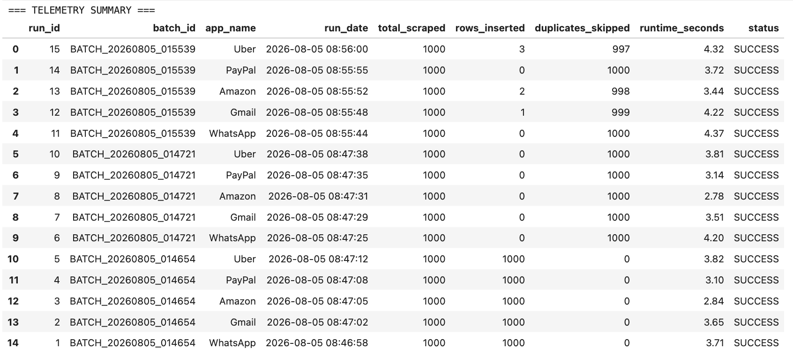

# Android App Store ETL Pipeline

This project is a robust, automated ETL data pipeline designed to scrape, clean, and store user review data from a portfolio of 20 top-tier Google Play Store applications. By converting unstructured, noisy app store feedback into a highly structured, queryable relational database, this pipeline lays the foundational data architecture required for downstream machine learning applications, sentiment analysis, and product analytics.

## Why the Google Play Store?
The Google Play Store serves as a massive, real-time repository of unfiltered user sentiment. By targeting this specific ecosystem, the pipeline captures high-velocity data that perfectly pairs standardized metrics (star ratings, timestamps, and app versions) with rich, qualitative text. This combination makes it an ideal, continually updating dataset for extracting actionable product insights and training Natural Language Processing (NLP) models.

---

## System Architecture (The ETL Process)
The pipeline executes a three-stage architecture:

*   **Extract:** Utilizing the Google Play Scraper API, the system programmatically extracts live, paginated user reviews across a 20-app portfolio (including WhatsApp, Uber, and YouTube). Rate limiting and sleep intervals are built in to handle large-scale pulls safely.
*   **Transform:** The raw data undergoes rigorous quality control. The text is standardized, and Python's `langdetect` library is applied to filter out non-English reviews. A word-count threshold removes low-signal data, and `pandas` is used to flag and isolate duplicates.
*   **Load:** The cleaned data is loaded into a local SQLite database. The schema is highly normalized, featuring isolated tables for Apps, Ingestion Batches, and Reviews. These tables are linked via foreign keys to ensure data integrity and support highly efficient database indexing for future queries.

---

## Database Architecture & Schema Design
The local SQLite database is built with a highly normalized relational schema designed for data integrity and downstream analytical querying. It automatically initializes through the Python script to ensure the structure exists prior to any data ingestion. 

The architecture consists of three core tables:

*   **Apps Table (Dimension Table):** Stores core application metadata. Features an auto-incrementing primary key (`app_id`) and enforces a `UNIQUE` constraint on the app name to prevent duplicate portfolio entries.
*   **Ingestion Batches Table (Audit Table):** Serves as the system's telemetry log. Records metadata for every pipeline execution, tracked by a primary `run_id` and grouped by a timestamped master `batch_id`. It captures performance metrics like runtime seconds, rows inserted, and duplicates skipped, providing a complete audit trail for the ETL process.
*   **Reviews Table (Fact Table):** The central repository for all scraped data. It enforces a `UNIQUE` constraint on the `store_review_id` from Google to guarantee pipeline idempotency. It employs foreign keys (`app_id` and `run_id`) to cleanly map each review back to its parent application and the specific batch that ingested it. This table houses both the raw text and the transformed boolean quality flags (e.g., `is_clean_baseline`, `is_english_flag`), which streamlines future database indexing and machine learning classification workflows.

---

## Key Engineering Features

### Idempotency & Duplicate Exclusion
The pipeline is entirely idempotent, meaning it can be executed continuously without duplicating data or corrupting the database. By enforcing a `UNIQUE` constraint on the store review IDs and utilizing an `INSERT OR IGNORE` SQL methodology, the system safely ignores previously ingested records and only appends fresh user feedback.

### Automated Telemetry & Batch Tracking
Every execution generates a master batch ID and records granular telemetry. The `ingestion_batches` table tracks the run date, total rows scraped, successful insertions, duplicates skipped, and total runtime seconds per app. 

---

## Quick Start / How to Run

### Project Structure
*   `android_pipeline.py`: The main Python script that contains the master execution loop and database initialization.
*   `notebooks/`: Contains a sample testing environment to validate the ETL logic and output telemetry summaries.

### Execution Steps
1. Ensure your environment has the required dependencies installed, primarily `pandas`, `google-play-scraper`, and `langdetect`. 
2. Run the main Python script in your terminal to build the schema, scrape the 20-app portfolio, and automatically generate the localized SQLite database (`play_store.db`).
3. Open the sample Jupyter Notebook to query the database, review the telemetry, and validate the idempotency constraints.

---

## Future Scope
With the structured database successfully populated and pipeline constraints fully validated, the next phase of this data architecture will involve building an automated orchestration schedule and applying unsupervised machine learning algorithms to classify user sentiment and categorize feature requests.
